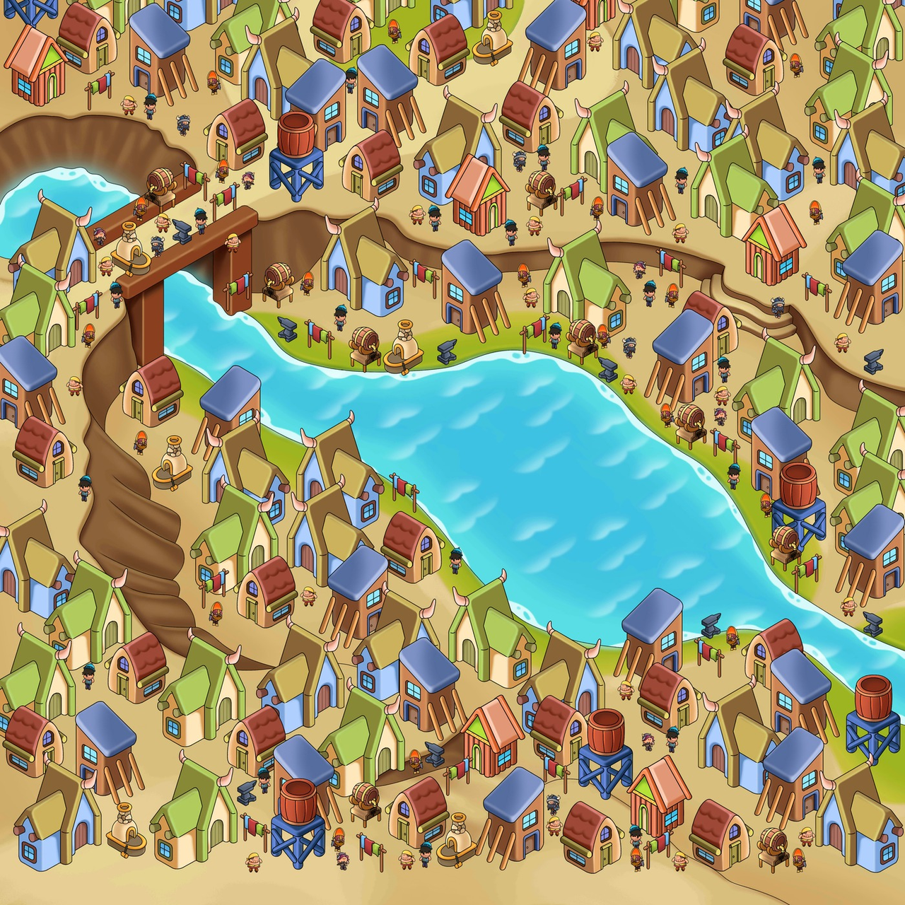
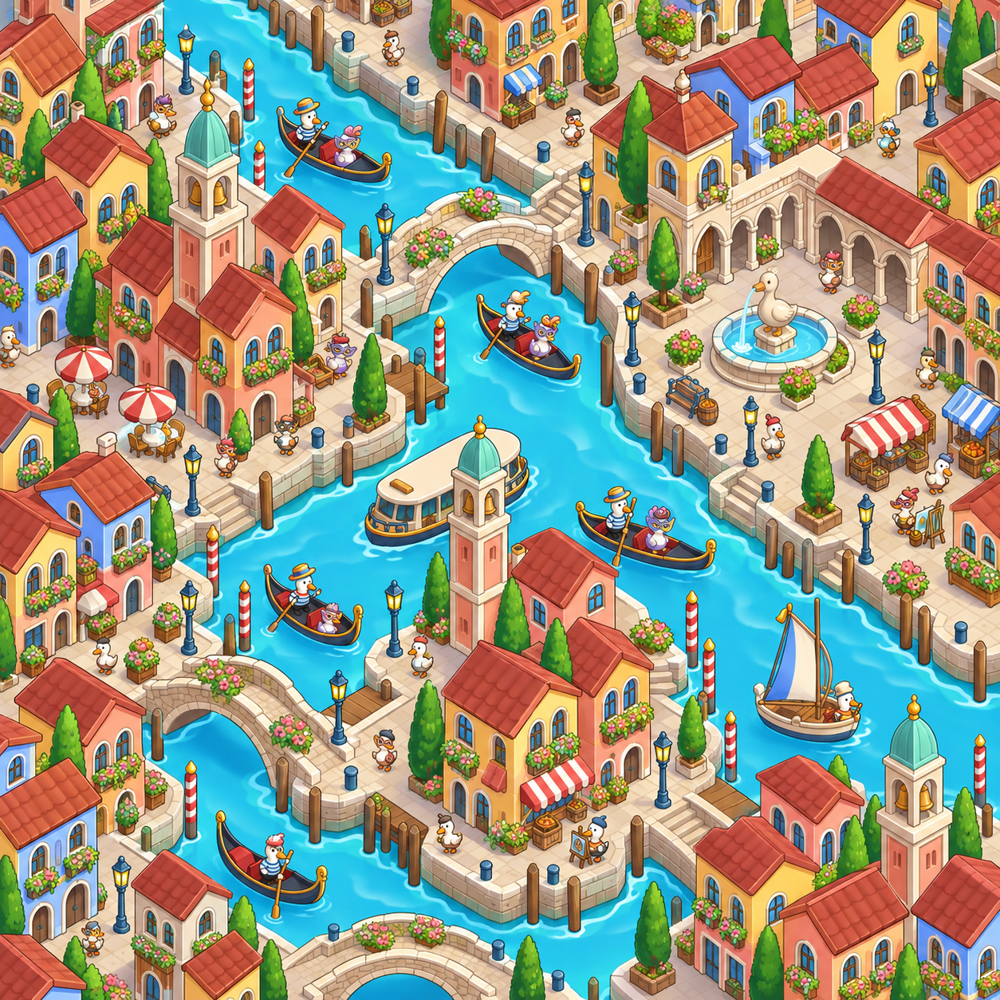
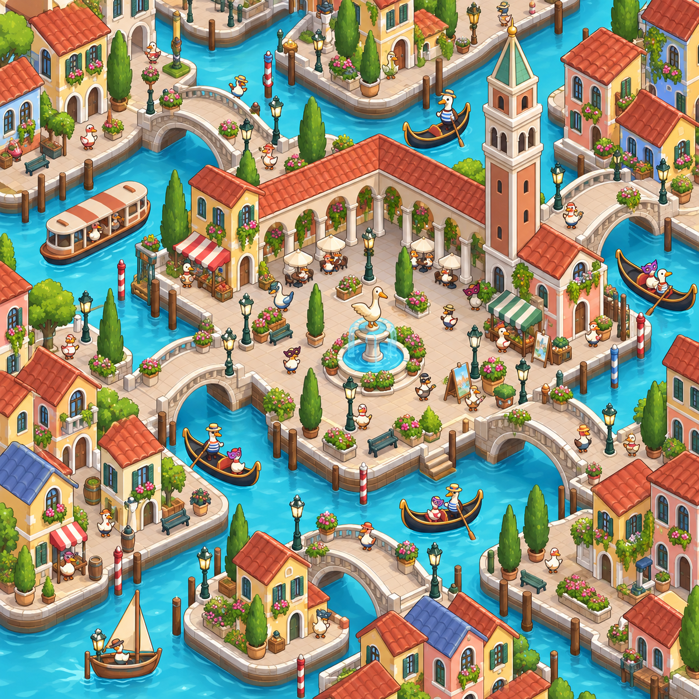

<div align="center">

# 主题场景工坊 · Stage 1
### Theme Scene Studio · Art Generation Stage 1

**用参考图延续美术风格，为新主题探索三种场景布局。**

1–3 张参考图 · 每主题 3 个候选 · 20 个内置主题 · 英文 Prompt 留档

[查看案例](#showcase) · [开始使用](#quick-start) · [浏览主题](skills/theme-scene-studio/references/themes.md) · [生成规则](skills/theme-scene-studio/SKILL.md)

</div>

---

## 在美术生成流程中的定位

**整套美术生成流程包含 Stage 1 和 Stage 2；本仓库与本插件仅负责 Stage 1。**

| 阶段 | 范围 | 与当前插件的关系 |
| --- | --- | --- |
| **Stage 1 · 主题场景候选生成** | 输入参考图与主题，每个主题生成三张候选，保存英文 Prompt 与检查记录。 | 当前插件负责。 |
| **Stage 2 · 后续美术生成阶段** | 具体输入、处理内容和交付规范另行定义。 | 不包含在当前插件中。 |

Stage 1 的交付是可供评审和后续使用的候选图及生成记录，不代表整个美术生成流程已经完成。调用名仍为 `$theme-scene-studio`。

<a name="showcase"></a>

## 真实案例：河畔村落 → 威尼斯水城

同一张参考图，重新组织为运河、石桥、钟楼与沿岸街区。参考图提供绘画语言与比例依据，目标主题决定环境和物件。

<table>
  <tr>
    <th width="50%">输入 · 河畔村落参考图</th>
    <th width="50%">输出 · 威尼斯水城，候选 C</th>
  </tr>
  <tr>
    <td><a href="docs/examples/venice/reference.png"></a></td>
    <td><a href="docs/examples/venice/candidate-c.png"></a></td>
  </tr>
</table>

### 一个主题，三种空间组织

三个候选独立使用同一张参考图，分别探索建筑群、地块与通路的不同安排。

<table>
  <tr>
    <th width="33%">A · 两岸均衡分布</th>
    <th width="33%">B · 中心广场聚集</th>
    <th width="33%">C · 连续岸线串联</th>
  </tr>
  <tr>
    <td><a href="docs/examples/venice/candidate-a.png"></a></td>
    <td><a href="docs/examples/venice/candidate-b.png"></a></td>
    <td><a href="docs/examples/venice/candidate-c.png"></a></td>
  </tr>
  <tr>
    <td>宽运河与支渠连接多个街区。</td>
    <td>钟楼、柱廊和喷泉构成集中活动区。</td>
    <td>沿岸街区与小广场形成连续节奏。</td>
  </tr>
</table>

本例主题清单：

| 建筑 | 角色 | 载具 | 道具 |
| --- | --- | --- | --- |
| 石拱桥、钟楼、广场柱廊、彩色民居 | 船夫鹅、面具鹅、商人鹅、画家鹅 | 贡多拉、水上巴士、小帆船 | 广场喷泉、路灯、系船柱、花坛、长椅 |

> 图片选自实际生成记录，点击可查看原图。展示结果仍有水面亮纹、花箱偏多等问题；候选 B 的主建筑偏大，个别角色位置也需复核。它们用于美术方向选择，尚非经过玩法验证的关卡。详见[案例来源与观察](docs/examples/venice/README.md)。

## 从输入到候选

| 输入 | 生成 | 交付 |
| --- | --- | --- |
| 1–3 张参考图＋主题清单 | 每个主题独立生成 A / B / C | 原始图片＋实际英文 Prompt＋检查记录 |

- **统一参考组**：默认第一张主导画风，其余补充细节；每张候选使用同一组参考图。
- **主题重构**：允许背景、地形、道路与建筑布局随主题改变，保留可辨识的游戏美术语言。
- **三个不同方案**：通过地块形状、建筑群位置和通路组织形成差异。
- **完整留档**：保存每次实际输入、候选图片、修正历史与目视结论。

**数量规则：主题数 × 3。** 三张参考图加两个主题，仍输出六张候选图。

## 最终 C 视觉方向

| 维度 | 目标 |
| --- | --- |
| 描边 | 依据邻近色块选择协调的同色系轮廓，减少统一黑色重边。 |
| 配色 | 减少大面积深重色及纯黑纯白，保留轻松的色彩与清楚的主体分离。 |
| 材质 | 减弱高光、反光、白色拉丝和亮边，同时保留建筑辨识度与柔和体积。 |

这些是生成与检查目标，实际输出仍需逐张评估。大画幅斑驳作为后续处理项记录。

<a name="quick-start"></a>

## 开始使用

在已安装插件的 Codex 任务中附上参考图，再描述主题：

```text
使用 $theme-scene-studio，参考这张图，
生成威尼斯水城主题的三张不同候选图。
```

多张参考图、多主题：

```text
使用 $theme-scene-studio，参考这三张图，以第一张为主风格，
生成预设 2 和 5，每个主题各三张候选。
```

也可以直接给出自定义清单：

```text
主题：浮空花园
建筑：花房、藤塔、园艺小屋
角色：园丁鹅、采花鹅
载具：花瓣舟
道具：藤桥、花盆、喷泉
```

默认使用一张参考图，最多支持三张；缺少图片时会先请求补充。生成依赖 Codex 环境中可用的内置图像工具，不包含独立模型 API 客户端。

## 输出结构

```text
output/theme-scene-studio/<run>/
├── manifest.json
└── theme-01/
    ├── candidate-A.png
    ├── candidate-A.prompt.txt
    ├── candidate-B.png
    ├── candidate-B.prompt.txt
    ├── candidate-C.png
    └── candidate-C.prompt.txt
```

不同候选全部保留；修正另存版本，不覆盖历史结果。场景图片不包含分层素材、碰撞、导航或游戏难度数据。

## 插件文件

| 文件 | 用途 |
| --- | --- |
| [.codex-plugin/plugin.json](.codex-plugin/plugin.json) | 插件入口与展示信息 |
| [SKILL.md](skills/theme-scene-studio/SKILL.md) | 输入契约、生成流程与验收规则 |
| [prompt-template.md](skills/theme-scene-studio/references/prompt-template.md) | 最终 C 英文基础模板 |
| [candidates.md](skills/theme-scene-studio/references/candidates.md) | 三候选的布局设计与完成定义 |
| [themes.md](skills/theme-scene-studio/references/themes.md) | 20 个内置主题及元素清单 |

<details>
<summary>浏览内置主题</summary>

非洲稀树草原 · 巨木森林 · 废土机车营地 · 东方水墨仙境 · 沙漠绿洲集市<br>
奥林匹斯山巅圣域 · 中世纪城堡 · 万圣节幽灵庄园 · 和风庭院与街道 · 海底亚特兰蒂斯<br>
赛博朋克街头 · 古埃及神殿 · 亚马逊雨林 · 蒸汽朋克城 · 狂野西部<br>
糖果乐园 · 月球基地 · 威尼斯水城 · 火山口营地 · 冰晶极地

</details>
