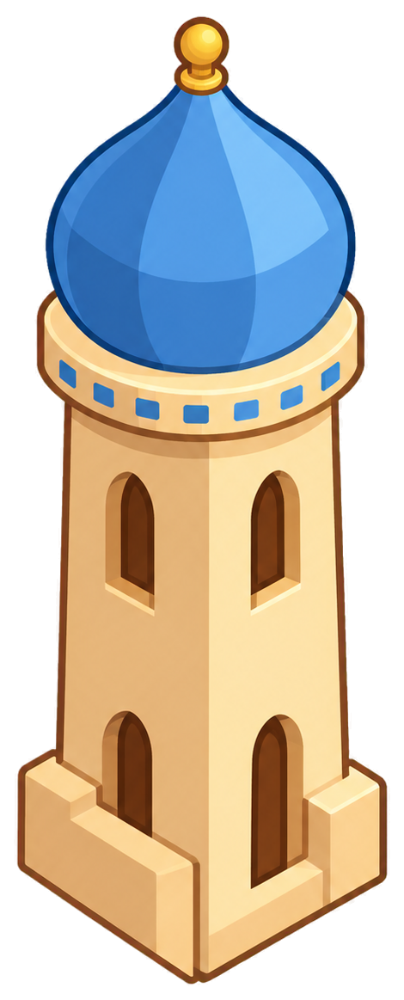
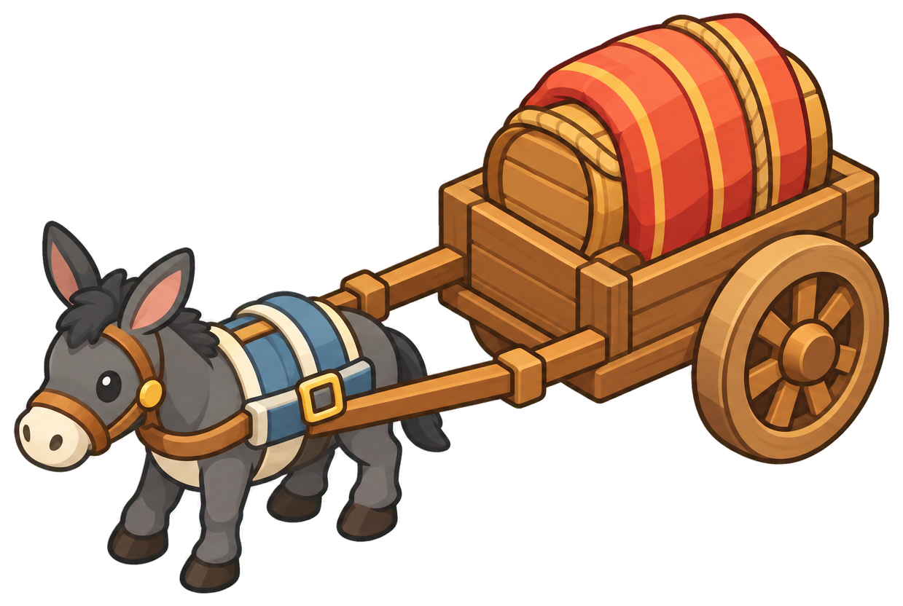
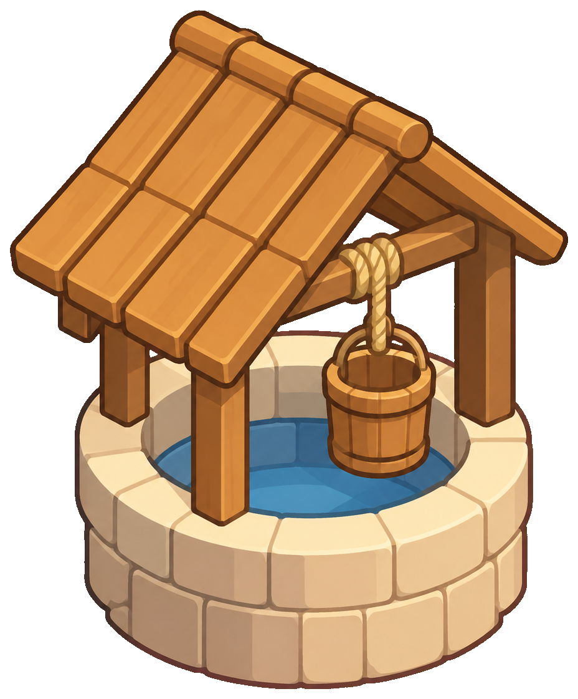
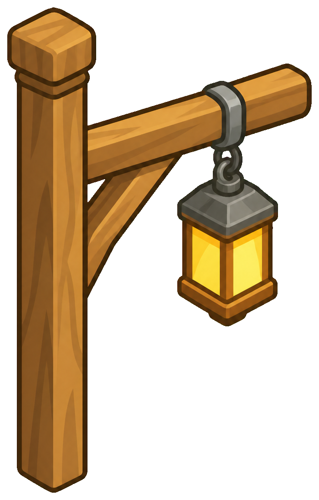
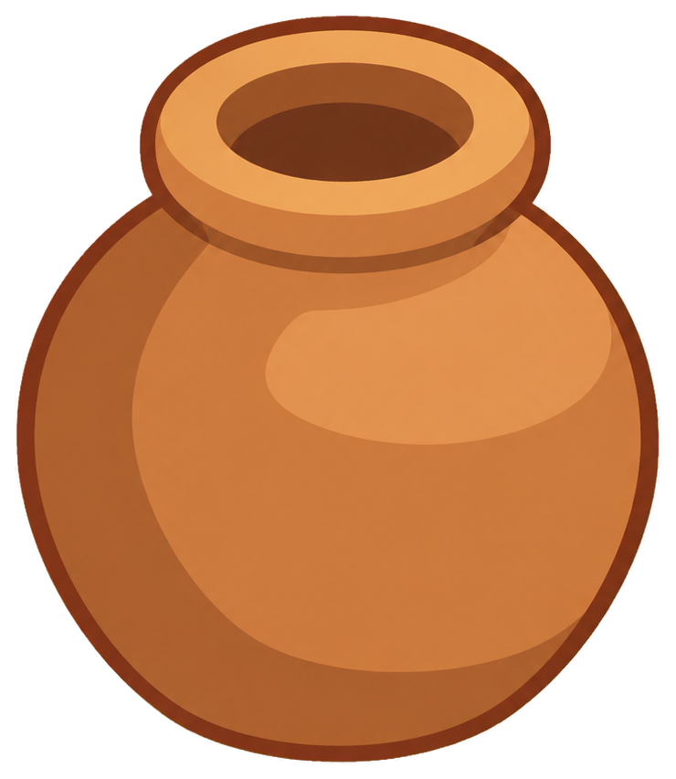
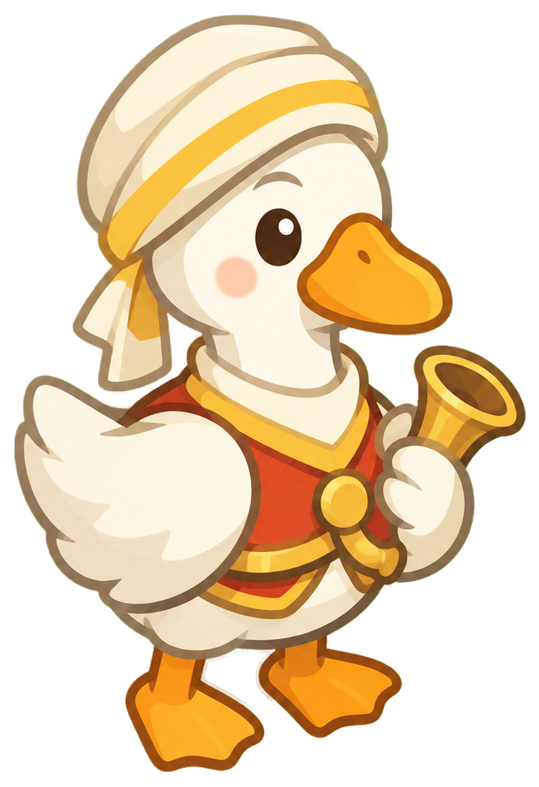
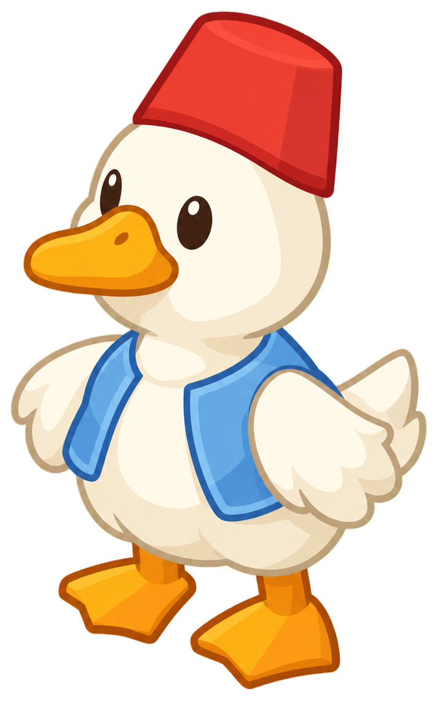

# Stage 2 案例 · 沙漠绿洲集市

[返回仓库首页](../../../../README.md) · [Stage 2 使用说明](../../../../plugins/theme-stage2/README.md)

本例使用 2026-09-14 已保存的正式规则运行结果：美术配置 1.4.0，背景为最新平衡版，物件沿用 V2 逻辑。配图直接复制原文件，没有为 README 重新生成。

<table>
<tr><th width="50%">输入 · 完整场景</th><th width="50%">输出 · 独立背景</th></tr>
<tr><td></td><td></td></tr>
</table>

背景移除建筑、人物、载具和独立设施，保留树木、水流、岸线及桥体或码头，并收敛内部细节与明暗。它是生成式重建，不是从原图直接擦除后的像素级复原。

## 全部 14 个独立素材

每张图对应一次独立对象生成，图片本身含真实 alpha；页面只负责排版，没有把素材回拼成场景。点击可查看原 PNG。

### 建筑

<table>
<tr><th width="25%">平顶土屋</th><th width="25%">穹顶塔楼</th><th width="25%">集市帐篷</th><th width="25%">橙篷商铺</th></tr>
<tr><td align="center"></td><td align="center"></td><td align="center"></td><td align="center"></td></tr>
<tr><td align="center">复核通过</td><td align="center">复核通过</td><td align="center">待调：描边取色</td><td align="center">复核通过</td></tr>
</table>

### 载具

<table>
<tr><th width="33%">绿洲帆船</th><th width="33%">载货骆驼</th><th width="33%">驴拉货车</th></tr>
<tr><td align="center"></td><td align="center"></td><td align="center"></td></tr>
<tr><td align="center">复核通过</td><td align="center">复核通过</td><td align="center">复核通过</td></tr>
</table>

### 设施

<table>
<tr><th width="25%">绿洲水井</th><th width="25%">棕榈树</th><th width="25%">悬挂路灯</th><th width="25%">陶罐</th></tr>
<tr><td align="center"></td><td align="center"></td><td align="center"></td><td align="center"></td></tr>
<tr><td align="center">复核通过</td><td align="center">复核通过</td><td align="center">复核通过</td><td align="center">待调：渐变</td></tr>
</table>

### 角色

<table>
<tr><th width="33%">头巾商人鹅</th><th width="33%">乐师鹅</th><th width="33%">红帽船夫鹅</th></tr>
<tr><td align="center"></td><td align="center"></td><td align="center"></td></tr>
<tr><td align="center">复核通过</td><td align="center">待调：头身比例、材质 / 高光</td><td align="center">待调：材质 / 高光</td></tr>
</table>

## 复核说明

背景复核通过；14 个素材中 10 个通过，4 个仍需微调。正式版表示采用当前正式规则，不代表所有生成候选都自动验收合格。

- 集市帐篷：红篷红线，米白帆布外围棕线仍偏深。
- 陶罐：矩形镜面亮斑已删除，罐身仍有轻微渐变。
- 乐师鹅：大头但头颈拉长，未完全达到短颈两头身；喙亮条已去，金扣与号角仍有亮边。
- 红帽船夫鹅：喙部仍有黄色亮条，背心边带偏亮。

文件对应关系、SHA-256 和复核状态保存在 [case.json](case.json)。示例只用于理解输入与输出，不是插件默认输入，也不是可玩关卡或完整素材库。
