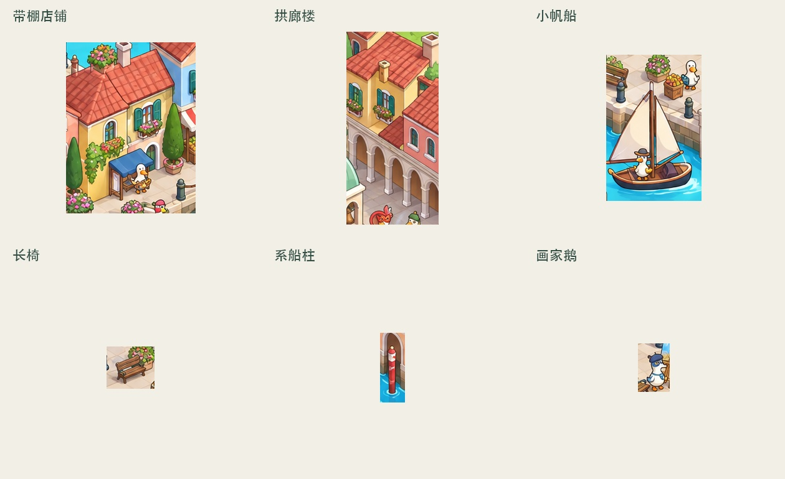

# Stage 2 默认选材：22种

默认独立素材为22种：建筑8种、道具6种、载具3种、角色5种，背景另计1张。种类按独立原型计算，重复摆放、仅换色或镜像不算新种类；每种归入一个类别，不重复计数。用户明确清单或种类要求优先，示例清单不覆盖默认规则。此规则仅约束种类，不规定每种摆放数量、目标款数量或总实例数。

## 分类与来源验收

- 建筑8、道具6、载具3、角色5，逐类核对，不跨类转移名额。
- 内部selection分类building/ facility/ vehicle/ character分别对应建筑/道具/载具/角色。facility含可独立使用的公共设施；船、陆车、火车均归载具，Layout交接保留boat/vehicle/rail_vehicle等真实类别。
- 每种须有选定Stage 1图中的可辨识来源；固定门窗附件留在建筑内，背景桥体和地形不计入独立素材。
- 来源不足时报告各类缺口；完整流水线回Stage 1修正，独立Stage 2不自动启动上游、不补造未见原型。
- 用户明确种类覆盖时使用相应运行配置并记录依据，不静默降低默认要求。实例数量沿用独立的scene-plan规则。

## 检查与交付

selection-check及prepare检查去重与逐类配额；prototype_key来自人工/视觉判断，不冒称像素自动去重。默认交付22张素材PNG和1张背景PNG，内部保留来源、Prompt与验收记录。历史运行保留原契约。

以下为旧14种规则下的历史案例，不作为当前默认：

## 威尼斯来源复核

原先8个样本之外，拟增加：带棚店铺、拱廊楼、小帆船、长椅、系船柱、画家鹅。下图仅是同一张 Stage 1 原图的裁片，不是新生成素材。

拱廊楼位于原图右上边缘，存在裁切；它可作为结构差异明显的候选，后续生成须明确排除邻居并仅补全必要部分。如果补全成本或保真度不理想，可在同一总量预算内换成其他明确可见的结构类型。

[14项建议清单](../examples/venice-representative-14.json) · [选材检查结果](selection/venice-14-assessment.json)

## 默认与用户指定规则的优先级

未指定数量、类别或素材清单时，默认22种素材（建筑8、道具6、载具3、角色5）＋1张背景。用户明确指定时，按用户指定规则执行，覆盖对应默认约束；仅指定总数时不强套8/6/3/5配额，指定完整清单时不额外补足22种。未涉及的要求继续沿用默认。
