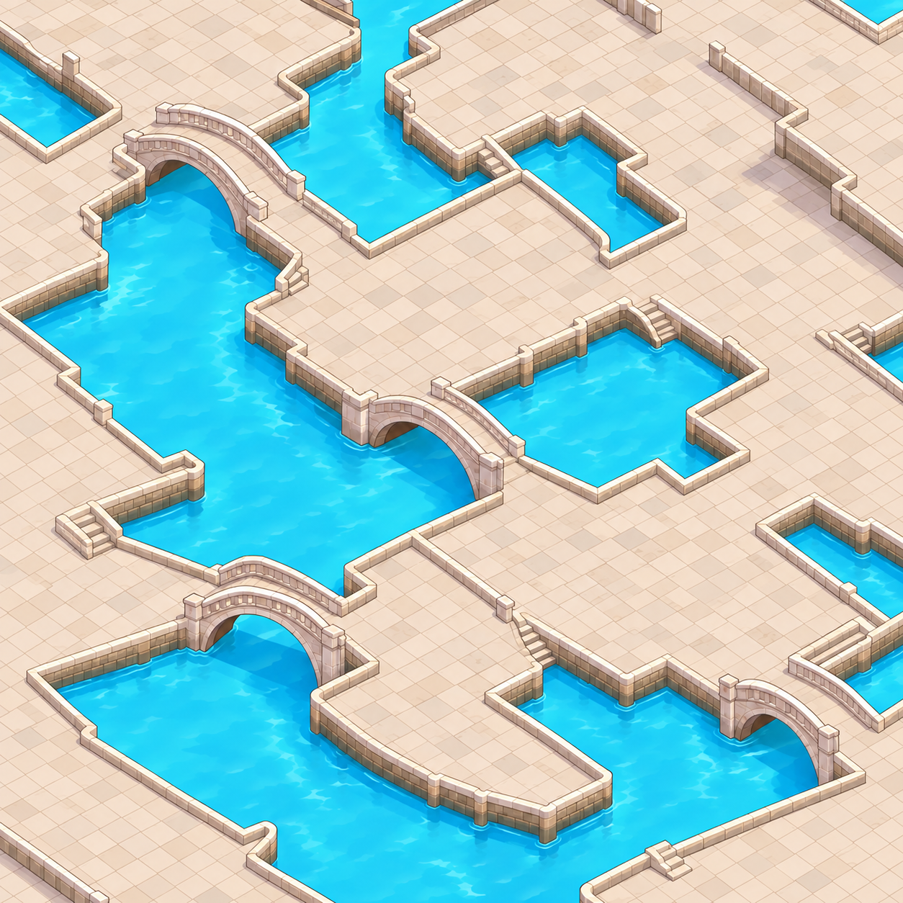

# 背景地形边缘：尽量无围栏、无包边

规则：`BG_OPEN_EDGES`。适用范围：**独立背景图**。来源：用户反馈，记录于 2026-09-10。配置版本：`playcity-art / 1.1.0`。

> 然后关于扣出的背景图，地形上尽量不要有围栏和包边。类似于截图这种最好不要有

## 生成目标

地面尽量开放，让地表自然接到边界。不要沿每一块地形、道路、平台或水岸画一圈凸起的结构。即便 Stage 1 原图已有这些东西，背景拆分时也不自动保留。

| 默认尽量移除或弱化 | 应保留的必要信息 |
| --- | --- |
| 围栏、护栏、地块矮墙、栏杆与沿边立柱 | 地块与水域的清晰分界 |
| 高于地面的路缘、厚石质压边、连续包边带 | 表达必要高差的简化竖直侧面 |
| 装饰性轮廓包边、粗亮边 | 符合统一风格的正常细描边 |
| 桥两侧无必要的护栏、矮墙与装饰边 | 桥面、桥洞、支撑轮廓及接岸关系 |

本条不是要求把地形削成没有侧面的平面，也不是移除正常描边。不能为了去包边而改变水域覆盖、破坏道路/桥梁连接或挖出新的缺口。

“尽量”保留必要的弹性：确实影响地形结构表达的最小边界可以极简保留，在视觉复核观察中说明位置和用途，不增加额外审批流程，也不默认为无需检查。

## 框架接入

- 在背景 Prompt 中加入该规则；不会将这一条加到建筑、交通工具、公共设施或角色的独立资产 Prompt 中。
- 将“保留桥”细化为保留桥面、桥洞及接岸关系，避免模型把栏杆也当成必须保留的整体。
- 背景的复核模板新增此条，结果须为 `pass / fail / unreviewed` 并对应实际候选图。
- 明显复现反例中的连续围栏/包边时标记 `fail` 并阻止导出。没有复核时保持 `needs_review`。
- 用户原话和截图作为规范证据绑定哈希，不作为第二张场景生成输入；同图裁片规则保持不变。
- 源飞书规范仍为 revision 147；新增规则用用户反馈来源标记，不伪造飞书 block ID。

此规则用于背景生成与图像绑定复核；包内反例仅用于解释规则。
